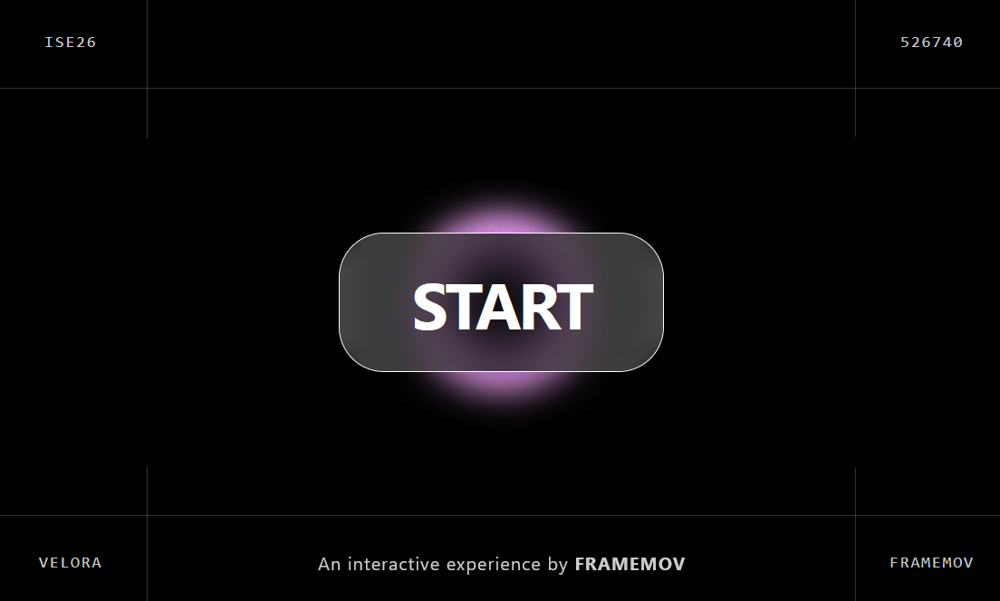
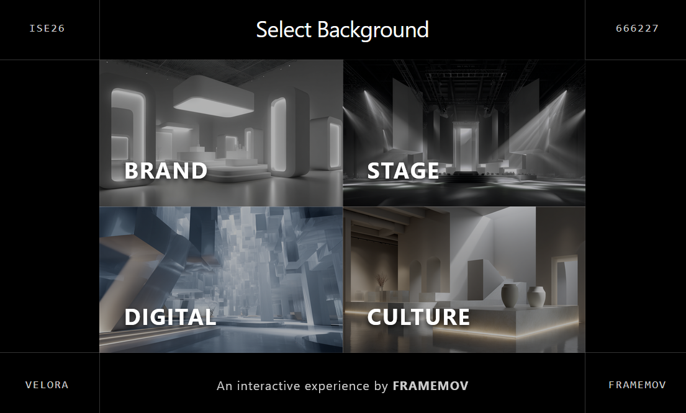
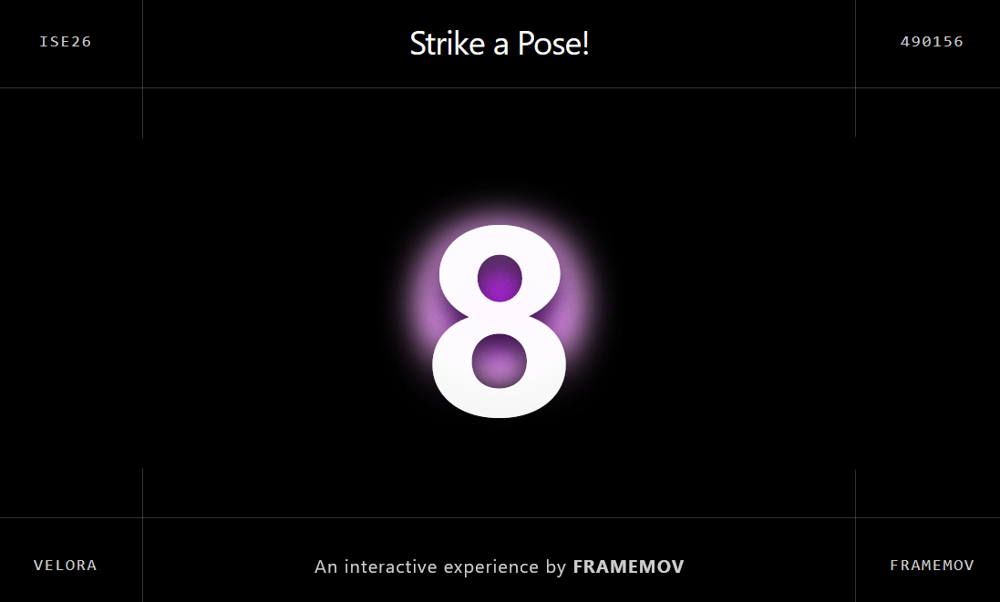

# AI Photobooth App

## Purpose
This application provides an interactive, AI-powered photobooth experience. It operates using a dual-client architecture (`client_screen` and `client_ui`) that communicates through a central server. 

The user flow is as follows:
1. **Background Selection:** Users interact with the `client_ui` (hosted on a tablet) to select their preferred background.
2. **Real-time Synchronization:** The `client_ui` sends WebSocket commands to the `client_screen` to update its display in real-time based on the selection.
3. **Capture:** A command from the `client_ui` enables the camera on the `client_screen` and takes a photo of the users.
4. **AI Processing:** The captured photo is sent to Nanobanana, which processes the image and creates an AI-composited final picture.
5. **Email Delivery:** After processing, the `client_ui` displays a form allowing users to enter their personal email address to receive the final processed photo.

## Technologies Used
- **Node.js**: Central backend server handling API requests and serving clients.
- **WebSockets**: Real-time, bi-directional communication between `client_ui` and `client_screen`.
- **Nanobanana API**: AI image processing and background replacement.
- **HTML / CSS / JavaScript**: Frontend interfaces for the tablet and main screen.

## Installation

### Prerequisites
- [Node.js](https://nodejs.org/) (v16 or higher recommended)
- npm or yarn

### Setup Instructions

1. **Clone the repository:**
   ```bash
   git clone <repository-url>
   cd <repository-directory>
   ```

2. **Install dependencies:**
   Navigate to the project directory and install the required packages.
   ```bash
   npm install
   ```

3. **Environment Configuration:**
   Configure your environment variables centrally. Create a single `.env` file in the root of `photobooth_ui` and add your required credentials, such as:
   - `HOST_IP` and `PORT` / `PHOTOBOOTH_PORT`
   - `VITE_SERVER_URL` (for the React clients to connect to the server)
   - `NANOBANANA_API_KEY`
   - `GCS_KEY_FILE` and `GCS_BUCKET_NAME`
   - `BREVO_API_KEY`, `BREVO_SENDER_EMAIL`, `BREVO_SENDER_NAME`

4. **Start the server:**
   Start the main communication server.
   ```bash
   npm start
   ```

5. **Launch the Clients:**
   - **Main Screen:** Open the `client_screen` interface on the device connected to the camera.
   - **Tablet UI:** Open the `client_ui` interface on the tablet device.
   - *Note: Ensure both clients are pointing to the correct local IP address and WebSocket port of the common server.*
  
## Screenshots

Home



Background selection



Take photo


